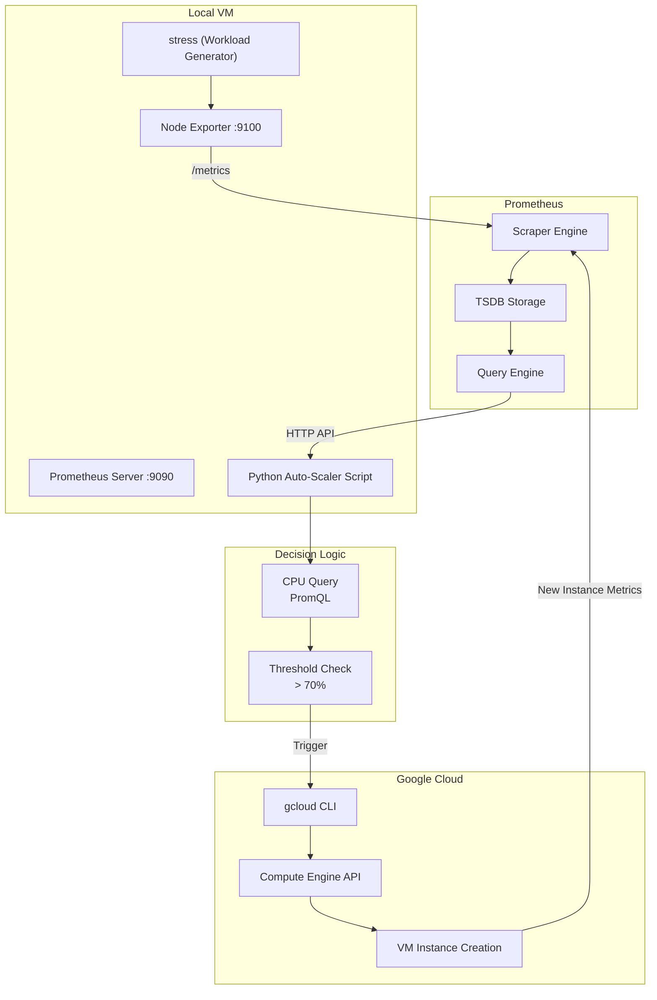

# Hybrid Auto-Scaling System (Local VM -> GCP)

## Overview
This project implements a hybrid auto-scaling system that monitors CPU utilization on a local virtual machine and provisions new VM instances on Google Cloud Platform (GCP) when a defined threshold is exceeded. It connects monitoring, decision logic, and cloud provisioning into a closed-loop control pipeline.

## Architecture



## Features
- Real-time CPU monitoring
- Prometheus-based observability
- Threshold-based auto scaling with cooldown
- Automated VM provisioning using gcloud CLI

## Requirements
- Python 3
- Prometheus
- Node Exporter
- Google Cloud SDK (gcloud)

## Metrics
Node Exporter exposes metrics at:

```
http://localhost:9100/metrics
```

Prometheus calculates CPU utilization with PromQL:

```
100 - (avg(rate(node_cpu_seconds_total{mode="idle"}[1m])) * 100)
```

## Project Structure

```
vcc-assignment-3/
├── README.md
├── requirements.txt
├── .gitignore
├── scripts/
│   ├── monitor.py
│   ├── autoscaler.py
│   └── gcp_create_vm.sh
├── prometheus/
│   └── prometheus.yml
├── diagrams/
│   ├── architecture.png
│   └── sequence.png
└── docs/
	└── report.pdf
```

## Setup

1. Install dependencies:
   ```bash
   pip install -r requirements.txt
   ```
2. Start Node Exporter:
   ```bash
   ./node_exporter
   ```
3. Start Prometheus:
   ```bash
   ./prometheus --config.file=prometheus/prometheus.yml
   ```
   UI: http://localhost:9090
4. Authenticate GCP:
   ```bash
   gcloud init
   ```
5. Run the auto-scaler:
   ```bash
   python scripts/autoscaler.py
   ```

## Failure Handling
- API request failures are handled with fallback logic.
- Empty metric responses are safely ignored.
- Cooldown prevents repeated scaling.
- Unique VM naming avoids collisions.

## Assumptions
- Node Exporter and Prometheus run locally.
- GCP account permissions are configured.
- gcloud CLI is authenticated.
- Network connectivity is available.

## Report
Full project documentation is available at:

- [docs/report.pdf](docs/report.pdf)

## License
This project is for academic and educational purposes.